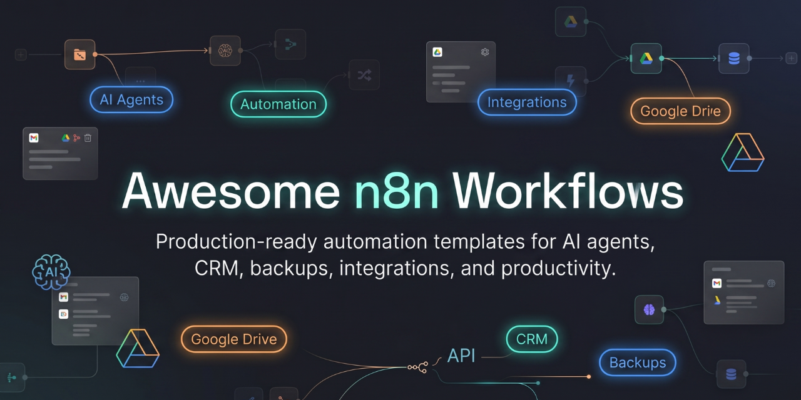

  

## Featured Workflow

### Google Drive Workflow Backup
Automatically backup all n8n workflows to Google Drive with automatic cleanup of old backups.

# Awesome n8n Workflows

Production-ready n8n workflows for automation, AI agents, CRM, backups, integrations, and productivity.

## Included Workflows

| Workflow | Description |
|---|---|
| Google Drive Workflow Backup | Automatically backup n8n workflows to Google Drive |

## Categories

- AI Automation
- CRM
- Google Workspace
- Backups
- Productivity
- API Integrations
- Lead Generation

## Goals

This repository aims to provide:

- production-ready workflows
- clean documentation
- reusable automations
- community templates
- beginner-friendly setup guides

## Usage

1. Download workflow JSON
2. Import into n8n
3. Configure credentials
4. Activate workflow

## Contributions

More workflows coming soon.
